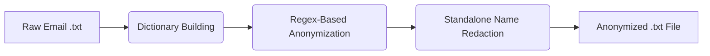

# System Blueprint: Portfolio Health Report Engine

## Overview
This document outlines the architecture for an automated analytical system designed for a Director of Engineering who needs to prepare for their Quarterly Business Review (QBR). The system ingests project communications and generates a "Portfolio Health Report" to quickly pinpoint risks, inconsistencies, and unresolved issues , creating a concise, high-signal report that tells the Director exactly where to focus their limited attention.

---
## 1. Data Ingestion & Initial Processing 

To ensure the system can handle large-scale data securely and efficiently, the ingestion pipeline relies on a robust, programmatic text-processing engine. By performing heavy lifting—such as anonymization and sanitization—locally via Python before data is sent to the LLM, we minimize token usage, reduce API costs, and strictly enforce PII (Personally Identifiable Information) boundaries.

### The Ingestion Pipeline
The system processes raw, multi-threaded email conversations stored in .txt files through the following automated steps:

1. **Extraction:** The system iterates through project directories, reading the raw .txt files and the accompanying project metadata (the Characters list).
2. **Entity Mapping:** It dynamically builds a dictionary mapping each project member's original name and email to an anonymized role-based identifier (e.g., Zsuzsa Varga becomes Business Analyst (BA) and varga.zsuzsa@... becomes businessanalystba@anonymized.com).
3. **Two-Pass Anonymization:**
   * **Pass 1 (High Confidence):** The pipeline uses exact string matching and regex word boundaries to replace full names and exact email addresses with their corresponding role identifiers.
   * **Pass 2 (Collision Handling):** Because different people may share the same first name (e.g., three different developers named "Anna"), mapping a standalone first name to a specific role causes misattribution. The system sweeps the remaining text and replaces any standalone first or last names with a generic `[ANONYMIZED_NAME]` tag to ensure privacy without hallucinating roles.
4.  **File Persistance:** The cleaned, PII-free text is saved into a dedicated directory, ensuring that all subsequent system components (and human auditors) only interact with anonymized data.

### Scalability & Large-Scale Processing
For enterprise-level volume, the architecture is designed as a **serverless, event-driven pipeline**:

* **Cloud-Native Event Triggering:** Raw files are uploaded to **Cloud Blob Storage** (e.g., AWS S3). This upload event automatically triggers a **Serverless Function** (e.g., AWS Lambda).
* **LLM-Assisted Redaction (Optional):** While programmatic regex-based redaction is the most cost-effective method, an LLM could be introduced as a secondary pass for complex PII identification in unstructured prose. However, this is treated as an optional high-cost feature for specific high-sensitivity use cases.

### Handling Edge Cases at Scale
Human communication is messy. To make this pipeline robust at an enterprise level, we must account for linguistic edge cases:

* **Nicknames & Diminutives:** Employees rarely use full formal names in casual threads (e.g., using "Pisti" for "István" or "Zoli" for "Zoltán"). While our current system catches formal names, a production-grade ingestion pipeline would incorporate a language-specific Nickname Mapping Library. This would normalize common diminutives back to their root names before applying the anonymization logic.

### Data Flow Diagram


---
## 2. The Analytical Engine (Multi-Step AI Logic)

The core of this system is an AI-driven analytical engine designed to parse the anonymized communication threads and extract high-signal "Attention Flags." These flags represent critical issues that threaten a project's scope, schedule, or resources, allowing the Director of Engineering to triage effectively without reading raw, multi-threaded emails. After the flags are extracted, a summarizer step is called on the flags grouped by project name.

**Note on Strategy**: While the production roadmap accounts for multi-stage extraction, this system utilizes a single-pass extraction logic as a deliberate choice for this Proof of Concept. By leveraging a high-reasoning model in a single pass, the system establishes a functional baseline that proves the core extraction logic is sound. This streamlined approach allows for rapid prototyping and faster iteration based on direct client feedback.

### Defining Critical "Attention Flags"
To ensure executive leadership only receives high-value alerts, the system is constrained to identify specific, high-impact categories:
* **Blocker:** Immediate obstacles that are currently halting development or deployment.
* **Emerging Risk:** Potential problems, technical hurdles, or obstacles identified in communications that lack a clear resolution path.
* **Unresolved Action Item:** High-priority questions or tasks that have been ignored or left pending for a significant period.
* **Scope Creep:** Feature requests or changes introduced outside the original project agreement.
* **Resource Bottleneck:** Delays caused by waiting on a specific role, team, or external dependency.
* **Timeline Delay:** Explicit mentions of slipping deadlines, pushed sprints, or missed milestones.
* **Technical Architecture Risk:** Engineering compromises that may cause technical debt or scaling issues down the line.
* **Stakeholder Misalignment:** Disconnects or conflicting expectations between the client, PMs, or the development team.

### Structured Extraction Strategy
To process the data programmatically and integrate it into a final "Portfolio Health Report," the AI uses **Forced Tool Calling** (Structured Outputs) enforced by strict Pydantic schemas. Instead of generating a free-text summary, the LLM must return a structured JSON object containing:
* `project_name`: (str) The specific project identified in the thread.
* `overall_health_status`: (enum) ["Healthy", "At Risk", "Critical"].
* `extracted_flags`: (list[dict]) A list of flags, each requiring:
    * `flag_types`: (list of exact categories defined above)
    * `severity`: (enum) ["Low", "Medium", "High", "Critical"]
    * `summary`: (str) 1-2 sentence executive summary of the specific issue.
    * `is_resolved`: (bool)
    * `reported_by` / `assigned_to`: (str) Anonymized roles.
    * `evidence_quote`: (str) Verbatim proof from text.
    * `project_name`: (str) Project name for the specific flag, in case multiple projects are discussed in the thread.

### Minimizing Hallucination & Ensuring Security
Hallucinations are a major risk in automated reporting. This architecture mitigates that risk through three specific mechanisms:
1. **The `evidence_quote` Requirement:** The extraction schema forces the AI to provide a direct verbatim quote from the text that proves the flag exists. If the model cannot extract a supporting quote, it is structurally discouraged from inventing the issue.
2. **Pre-Processed Context (Security):** By feeding the AI strictly anonymized data (e.g., `Frontend Developer` instead of an actual name or email), the model operates securely without ingesting Personally Identifiable Information (PII). This prevents potential data leaks into third-party AI provider logs.
3. **Objective System Prompting:** The LLM is framed as an "Objective Project Management Auditor." It is explicitly instructed to act objectively.

### The "Map-Reduce" Aggregation Process
Because multiple email threads may relate to the same project, the system implements a two-stage logic:
1.  **Map:** Each email thread is analyzed independently to extract structured JSON flags.
2.  **Reduce (Grouping):** A Python-based orchestrator groups these flags by `project_name`. It then triggers a final **Executive Summarizer** pass to synthesize these discrete flags into a single, cohesive project narrative for the Director.

### The Full Prompts
Below are the two prompts used in the extraction and summarization steps. The whole configuraiton can be found in the **config.yaml** file.
#### The Full Extraction Prompt

```text
# ROLE
    You are an Objective Project Management Auditor and Executive AI Assistant.
    
    # OBJECTIVE
    Review the provided anonymized project email communications and extract a "Portfolio Health Report." 
    Your goal is to pinpoint risks, inconsistencies, and unresolved issues, creating a high-signal 
    report that tells the Director of Engineering exactly where to focus their attention.
    
    # REVIEW CRITERIA (ATTENTION FLAGS)
    You must classify issues ONLY into the following categories:
    - "Emerging Risk": Potential problems or obstacles without a clear resolution path.
    - "Blocker": Immediate obstacles halting development.
    - "Unresolved Action Item": High-priority questions/tasks ignored or left pending.
    - "Scope Creep": Feature requests or changes introduced outside the original scope.
    - "Resource Bottleneck": Delays caused by waiting on a specific role or dependency.
    - "Timeline Delay": Explicit mentions of slipping deadlines or missed milestones.
    - "Technical Architecture Risk": Engineering compromises causing future technical debt.
    - "Stakeholder Misalignment": Disconnects with the client or product managers.

    # SEVERITY LEVELS
    Rate each flag as: "Low", "Medium", "High", or "Critical".
    
    # EXTRACTION RULES
    1. STRICT OBJECTIVITY: Do not infer emotions or office politics. Base findings ONLY on the text.
    2. EVIDENCE REQUIRED: Every extracted flag MUST include an `evidence_quote`—a verbatim, 
       direct quote from the email thread that proves the flag exists. If you cannot quote it, do not flag it.
    3. RESOLUTION STATUS: Determine `is_resolved` based on whether the thread concludes with a clear decision or agreed-upon fix. Verbal agreement in the email 
    (e.g., "we will remove this from scope" or "I will fix this") counts as RESOLVED. Do not demand proof of formal Jira updates or sprint re-planning.
    4. CONSOLIDATION (CRITICAL): Group related aspects of a single problem into ONE comprehensive flag to avoid alert fatigue. 
    If an issue touches multiple categories, include multiple types in the `flag_types` list rather than creating separate flags.
    5. MATERIAL IMPACT ONLY: Ignore routine administrative requests (e.g., asking for weekly status reports, timesheets), office banter, 
    and minor human errors (e.g., sending an email to the wrong thread). Only extract flags that pose a genuine, material threat to the 
    technical architecture, project scope, timeline, or resources.
    6. PERMISSION TO BE HEALTHY: If a thread contains no material risks, blockers, or unresolved architectural questions, 
    return an empty list [] for `extracted_flags` and mark the `overall_health_status` as "Healthy". Do not invent risks or act like a micromanager.

    # OUTPUT INSTRUCTIONS
    Extract a list of flags as dictionaries. Each dictionary must contain the following keys:
    - flag_types (list of str: One or more of the exact categories above)
    - severity (str: Low, Medium, High, or Critical. Use the highest applicable severity for consolidated flags)
    - summary (str: 1-2 sentence concise executive summary of THIS SPECIFIC ISSUE ONLY. Do not bleed context or mention other unrelated flags in this summary.)
    - is_resolved (bool: True if resolved, False if pending)
    - reported_by (str: The anonymized role of the person who first raised the core issue)
    - assigned_to (str: The anonymized role responsible for fixing it, or "Unassigned")
    - date_reported (str: Date the issue was first raised)
    - evidence_quote (str: Short, verbatim quote proving the primary issue)
    - project_name (str: The name of the project as mentioned in the email thread)

```
#### The Short Summarizer Prompt

```
You are a Director-level Executive Assistant. 
    Your job is to read a list of extracted project risks and blockers, and write a cohesive, 
    2-paragraph executive summary that highlights the most critical themes.
    Do not use bullet points. Write in clear, professional prose.
```
---
## 3. Cost & Robustness Considerations

### Robustness Against Misleading Information
To ensure the system is resilient against ambiguous or misleading information, the architecture relies on strict auditability and deduplication:

1. **Auditable Evidence Quotes:** The schema requires an `evidence_quote` for every flagged issue. While an LLM can still make mistakes or misinterpret context, extracting a verbatim quote provides an immediate verification mechanism. A reviewer can quickly check the quote against the generated summary to confirm the AI didn't hallucinate a problem or take a sarcastic comment out of context.
2. **Resolution Traceability:** By extracting an `is_resolved` boolean, the system tracks the lifecycle of an issue within the thread. This allows reviewers to verify if an alarming blocker was actually handled by the end of the conversation, preventing unnecessary panic over already-solved problems.
3. **Simplified Consolidation:** Human email threads are repetitive. The prompt explicitly instructs the AI to group related aspects of a single problem into one comprehensive flag. This prevents the system from generating redundant alerts every time the same issue is discussed in a reply-all chain.
4. **Deterministic Configuration:** The engine is configured with a **Temperature of 0.0**. This minimizes "creative" variance and ensures that the extraction remains consistent and reproducible across multiple runs of the same data.

### Cost Management Strategy
Running an LLM over thousands of enterprise emails can quickly become cost-prohibitive. For this Proof of Concept, the strategy prioritized accuracy over cost by utilizing a highly capable model (Claude 4.6 Sonnet) to definitively prove the extraction logic works. 

To manage costs in a scaled production environment, the system would implement the following optimizations:

* **Model Downgrading & Task Splitting:** The primary goal is to transition the workload to a cheaper, faster model (e.g., Claude  Haiku). If the cheaper model struggles with the complex, multi-step extraction prompt, the prompt will be broken down into smaller, sequential sub-tasks and also a routing prompt can be used that simply asks "Does this thread contain a risk? Yes/No" before running the full extraction.
* **Prompt & Tool Caching:** Currently, enforcing structured outputs requires passing heavy Pydantic tool definitions to the LLM on every call, which increases input token costs. In production, we would leverage Prompt Caching (available via Anthropic/AWS) to cache the static system instructions and tool schemas, drastically reducing the cost of repeated calls.
* **Batch API Processing:** Since a Quarterly Business Review (QBR) report does not need to be generated in real-time within milliseconds, the ingestion pipeline can bundle the text payload and submit it as a Batch Job (supported natively by AWS and Anthropic). Batch processing typically reduces API costs by up to 50% in exchange for asynchronous processing times.

---

## 4. Monitoring & Trust

To deploy this in a production environment, the Director of Engineering must trust that the AI is not crying wolf or missing critical fires. 

### Key Metrics to Track
We will monitor the following metrics via a centralized dashboard:
1. **Precision & Recall (vs. Gold Standard):** Using a curated "Gold Standard" test dataset we measure how many real risks the AI identified (Recall) and how many of its alerts were actually valid (Precision). This is the primary metric for system accuracy.
2. **The Hallucination Rate (Quote Mismatch):** Tracking instances where the extracted `evidence_quote` does not accurately map back to the source text. 
3. **Alert Fatigue Ratio:** The average number of attention flags generated per project per week. If a project generates 50 flags a week, the prompt's severity threshold needs tuning to prevent the Director from ignoring the reports.
4. **Cost Per Insight:** We track the total API spend against the number of unique "High" or "Critical" flags generated. This ensures the system remains economically sustainable and guides decisions on model routing and prompt caching optimizations.


### Maintaining System Trust 
A "static" AI pipeline is a risk. We maintain trust through continuous improvement:

1.  **Regression Testing:** Before any prompt update is deployed to production, it must be run against the **Evaluation Test Dataset**. The new prompt is only accepted if it maintains or improves the previous Precision and Recall scores.
2.  **Human-in-the-Loop (HITL) Validation:** The report interface will include a simple "Was this flag helpful? [Yes/No]" button. This data is used to create a "Gold Standard" dataset for future model fine-tuning.
3.  **Data Drift Monitoring:** As team communication styles evolve (e.g., shifting from email to Slack), the system monitors for "Unclassified" issues or threads where the AI struggled to extract a clear project name. This triggers a prompt update to handle new communication patterns.
4.  **Source-of-Truth Linking:** Every summary in the final report is a clickable link that takes the Director directly to the specific email file. 

---

## 5. Architectural Risk & Mitigation


**The Single Biggest Risk: Context Fragmentation**
Even in this simplified version, the biggest architectural risk is context fragmentation. Engineering conversations rarely happen in a single vacuum. A risk might be flagged in an email thread, but the actual resolution might happen in a Slack channel, a Jira ticket update, or a pull request comment. If the system only ingests isolated emails, it will continuously report "Unresolved Action Items" that have actually been resolved elsewhere, quickly destroying the Director's trust in the tool.

**Mitigation Strategy: Unified Data Aggregation**
To mitigate this, the architecture must evolve into a centralized data ingestion pipeline. Instead of processing emails in isolation, all text communications (Slack channels, Jira comments, Email threads) mapped to a specific `project_id` should be extracted, anonymized, and merged into a single, chronologically sorted text timeline. By feeding the analytical engine this unified cross-platform context, the AI can accurately trace an issue from its origin in an email to its final resolution in a Jira ticket, effectively eliminating false "unresolved" alarms.

---

## 6. Evaluation & Future Improvements

During the development and testing of this Proof of Concept, several key behavioral patterns and data inconsistencies were identified. These insights provide a roadmap for moving from a prototype to a production-grade system.

### Key Observations from Testing
* **Sensitivity Calibration:** Initial testing showed the model could be overly pessimistic. In "Project Phoenix," the AI initially flagged a de-scoped feature as "Unresolved" because it lacked a formal Jira reference. I successfully mitigated this by refining the prompt to recognize **verbal agreement** as a valid resolution state for email-based workflows.
* **Recall vs. Precision (Sentiment Bias):** In threads with an overall "Healthy" or productive tone, the LLM occasionally suffered from "Optimism Bias," missing minor sub-tasks (e.g., a clickable footer logo) buried in a positive email. 
* **Naming Inconsistency:** Without a pre-defined project list, the AI relied on Subject lines for categorization. This led to fragmented reports when subjects varied slightly (e.g., "Divatkirály Webshop" vs. "Project DIVATKIRÁLY").

### Proposed Production Roadmap
To address these findings at scale, I propose the following architectural evolutions:

1.  **Multi-Stage Extraction Pipeline:** To improve recall, I would move from a single-pass extraction to a structured multi-stage pipeline:
    * **Pass 1 (Fact Miner):** A low-temperature pass dedicated to creating an exhaustive inventory of every request, question, or change mention in the thread.
    * **Pass 2 (Categorization & Extraction):** For each item identified in Pass 1, the engine performs the full extraction logic (determining severity, status, roles, and evidence). This ensures that "buried" items receive the same level of scrutiny as primary topics.
    * **Pass 3 (Final Audit - Optional):** An optional high-reasoning "Auditor" pass to verify that the extracted flags are consistent and do not contradict the overall thread conclusion.
2.  **Master Project Mapping:** I would provide the LLM with a "Master Project List" to group fragmented project names into a single consolidated health report.
3.  **Few-Shot Calibration:** To further improve resolution detection, I would incorporate "Few-Shot Examples" in the system prompt, providing the model with specific examples of ambiguous email resolutions versus actual unresolved blockers.
4.  **PII Edge-Case Handling:** During testing, I noticed specific email header formats (e.g., `<name@domain.hu>` with nested brackets) occasionally bypassed simple regex. In production, I would implement a more robust version, or use LLM for removing PII.
5. **Summarizer customization and formatting:** Based on client needs and requirements rework the summarizer prompt, with an additional optional formatting step (e.g. HTML).